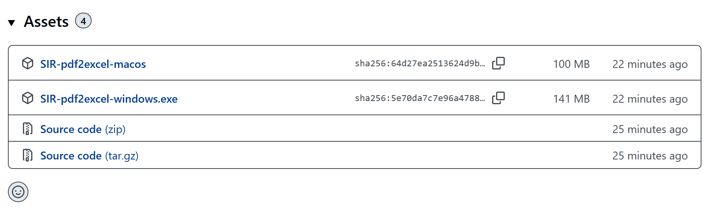
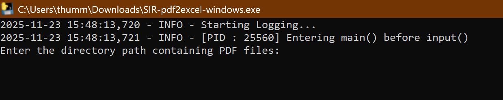
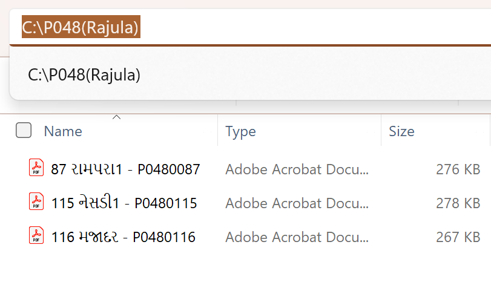
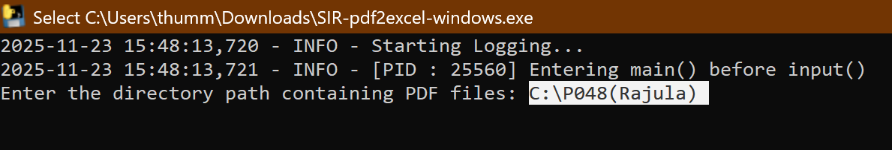
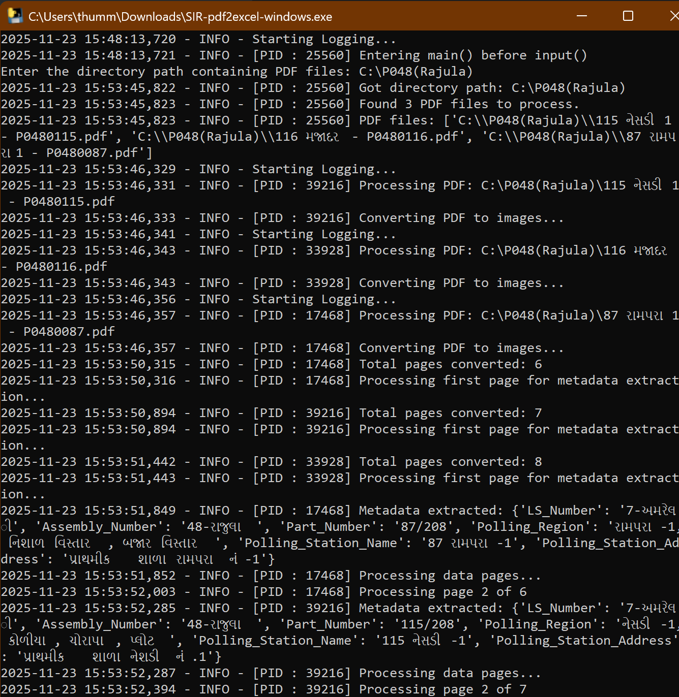
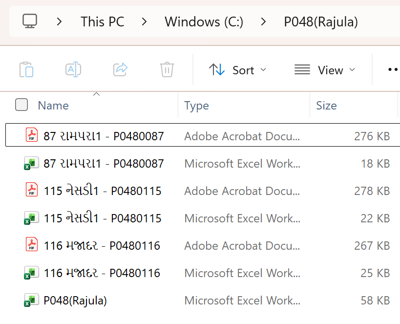

# SIR-PDF2Excel
Gujarat SIR Data PDF to Excel convertor

# How to use this application?
1. Go to the [SIR-pdf2excel (Gujarat) latest releases](https://github.com/MathRunner7/SIR-PDF2Excel/releases/latest) and download the latest version of the application.
    For Windows users, download the `SIR-pdf2excel-windows.exe` file.
    For macOS users, download the `SIR-pdf2excel-macos` file.
    
2. Run the application by double-clicking on the downloaded file. It will ask for necessary permissions; please allow them.
3. When application is opened, you will see a window like this:
    
4. It will ask you to enter folder path where your SIR PDF files are stored.
    
5. Copy the folder path from your file explorer and paste it into the input box in the application.
    
6. Press Enter from your keyboard after pasting the folder path.
7. The application will start processing the PDF files in the specified folder and convert them to Excel format.
    
8. Once the conversion is complete, application will be closed automatically and you will find the Excel files in the same folder as your PDF files.
    
9. You can now open and use the Excel files as needed.
10. Individual Excel files will be named after their corresponding PDF files.
11. Consolidated Excel file containing data from all PDFs will be named `folder_name.xlsx`.